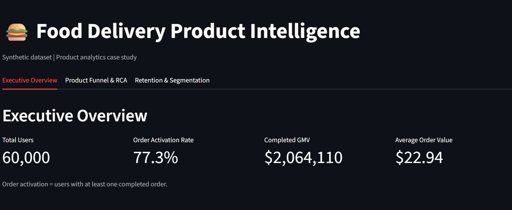
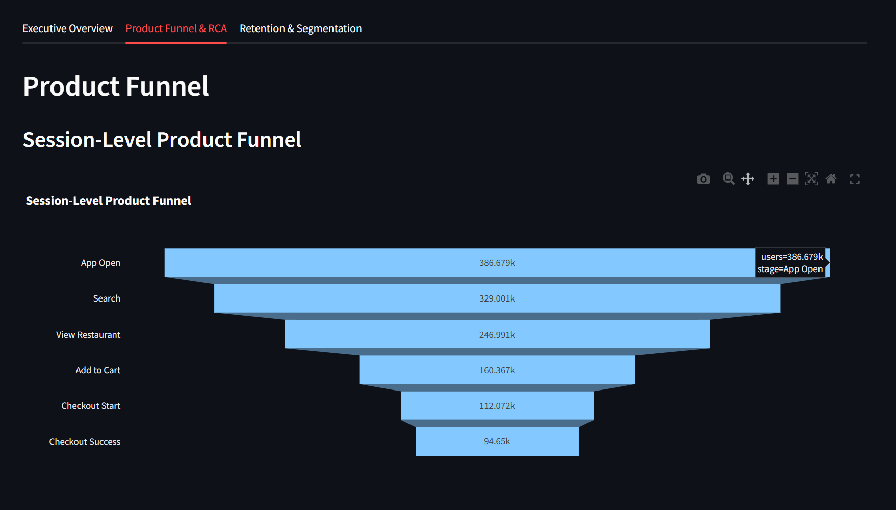
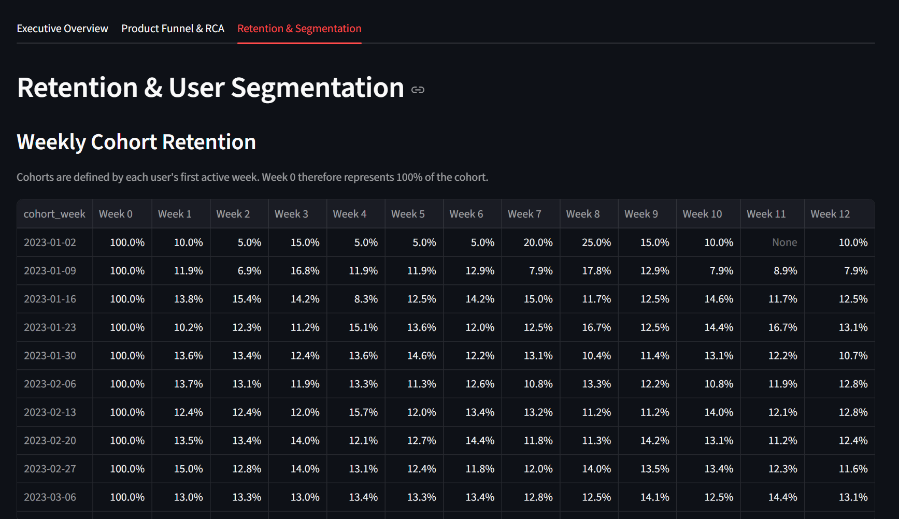

# Food Delivery Product Intelligence — Product Analytics Case Study

> **\*\*Note:\*\*** This is an independent product analytics case study built using a synthetic food-delivery marketplace dataset. It is not based on any company's internal data, systems, or proprietary information.

---

## 📌 Project Overview

This project simulates a product analytics workflow for a food-delivery marketplace.

The objective is to understand how users move through the product journey, identify conversion and retention opportunities, investigate localized product performance issues, and translate analytical findings into actionable product recommendations.

The project covers the complete analytical flow:

**\*\*User Behaviour → Product Journey → Funnel → Conversion → Retention → Segmentation → Growth Metrics → Root Cause Analysis → Recommendations → Monitoring\*\***

The project was designed as a portfolio case study to demonstrate practical Product Analyst skills including advanced SQL, Python analysis, product metrics, funnel analysis, cohort analysis, segmentation, root-cause analysis, dashboarding, and KPI monitoring.

---

## 🎯 Business Problem

A food-delivery marketplace needs to understand:

- Where users drop off during the ordering journey

- Which stages of the product funnel have the largest conversion losses

- How user engagement changes over time

- Which user segments generate more orders and spend

- Whether a product issue is localized to a particular platform, app version, city, or user segment

- Which metrics should be monitored continuously

- What product or engineering actions should be considered based on the analysis

This project uses synthetic data to investigate these questions through a structured product analytics workflow.

---

## 📊 Dataset

The dataset is synthetically generated using Python and contains correlated user, session, event, restaurant, and order behaviour.

### Approximate Scale

| Entity | Volume |

|---|---:|

| Users | 60,000+ |

| Sessions | 380,000+ |

| Events | 1.3M+ |

| Orders | 94,000+ |

| Restaurants | 1,000 |

### Core Entities

- **\*\*Users\*\*** — acquisition channel, platform, app version, city and user attributes

- **\*\*Restaurants\*\*** — restaurant-level information

- **\*\*Sessions\*\*** — user sessions and activity timing

- **\*\*Events\*\*** — product journey events such as search, restaurant views, cart actions and checkout

- **\*\*Orders\*\*** — completed and cancelled orders, order value, discount and delivery fee

The data is intentionally synthetic and should not be interpreted as real company performance data.

---

## 🧱 Architecture

- **\*\*Data Generation:\*\*** Python, Pandas, NumPy

- **\*\*Analytical Database:\*\*** DuckDB

- **\*\*Analysis:\*\*** SQL + Python

- **\*\*Visualization:\*\*** Plotly

- **\*\*Dashboard:\*\*** Streamlit

- **\*\*Testing:\*\*** pytest

### Analytical Workflow

```text

Synthetic Data

      ↓

DuckDB

      ↓

Advanced SQL

      ↓

Python Analysis

      ↓

Product Metrics

      ↓

Funnel & Cohort Analysis

      ↓

Segmentation

      ↓

Root Cause Analysis

      ↓

Product Recommendations

      ↓

KPI Monitoring

      ↓

Streamlit Dashboard

🔍 Product Analytics Questions

The analysis focuses on questions such as:

How many users enter the product journey?

Where do users drop off in the ordering funnel?

What is the overall checkout conversion rate?

How does retention change across weekly cohorts?

Which user segments show higher spending behaviour?

Are conversion problems concentrated in a particular platform, app version, or city?

How can localized performance deterioration be detected?

Which product or engineering actions should be investigated?

Which KPIs should be monitored automatically?

📈 Key Findings

1. Product Funnel

The session-level funnel contains the following stages:

App Open

   ↓

Search

   ↓

Restaurant View

   ↓

Add to Cart

   ↓

Checkout Start

   ↓

Checkout Success

Observed Funnel Results

Funnel Stage      Sessions

App Open    386,679

Search      329,001

Restaurant View   246,991

Add to Cart 160,367

Checkout Start    112,072

Checkout Success  94,650

Overall session-to-success conversion is approximately:

24.48%

The largest relative drop-off occurs around the restaurant-view → add-to-cart stage, making this an important area for product investigation.

2. Checkout Root Cause Analysis

A segmented checkout analysis was performed across:

Platform

App version

City

The analysis identified a localized performance difference:

Android + v1.9 + Chicago

Metric      Value

Checkout attempts 5,440

Successful checkouts    3,960

Checkout success rate   72.79%

The comparable checkout-success baseline is approximately 84.5%, giving a difference of roughly:

11.7 percentage points

This does not prove the underlying technical cause. It identifies a high-volume segment that warrants deeper investigation.

Suggested Investigation

An engineering/product investigation could examine:

Checkout API errors

Payment failures

App-version-specific bugs

Network-related failures

Device-level patterns

Checkout latency

Error logs

Payment gateway responses

Changes introduced in Android v1.9

The analysis therefore demonstrates the distinction between identifying a statistical/product signal and proving its underlying cause.

3. Cohort Retention

Weekly retention is calculated using each user's first active week as the cohort.

This prevents the cohort definition from depending on signup timing when the analytical question is focused on product activity.

Metric

Retention % =

Active users in cohort week /

Total users in cohort × 100

Week 0 represents the full active cohort and therefore starts at 100%.

This analysis allows retention behaviour to be compared across different user cohorts and weeks since first activity.

4. User Segmentation

Users are segmented based on their total completed-order spend.

Segmentation Method

Users are divided into three approximately equal-sized groups using NTILE(3) based on total completed-order spend.

Segments

Segment     Completed Spend

Low Value   ≤ $15.79

Medium Value      > $15.79 and ≤ $42.32

High Value  > $42.32

Each segment contains approximately one-third of the 60,000 users, or 20,000 users.

The segmentation is also broken down by acquisition channel to understand how different acquisition sources relate to downstream user behaviour.

Important: Total completed spend is used as a behavioural value measure in this case study. It is not presented as formal Customer Lifetime Value (LTV).

📐 Product Metrics

The project tracks several product and business metrics.

Acquisition

Total Users

Number of unique users in the dataset.

Activation

Activated Users

Users who completed at least one order.

Activation Rate

Activated Users / Total Users × 100

Funnel Conversion

Step Conversion =

Users completing current step /

Users completing previous step × 100

Retention

Weekly Retention =

Active Users in Cohort Week /

Cohort Size × 100

Monetization

Average Order Value (AOV)

Completed GMV /

Number of Completed Orders

Completed GMV

Total order value generated from completed orders.

Repeat Purchase

Percentage of activated users who completed at least two orders.

🧠 Advanced SQL Analysis

The project uses SQL for most of the core analytical work.

Techniques include:

Common Table Expressions (CTEs)

JOINs

CASE statements

Conditional aggregation

Window functions

Date transformations

Cohort calculations

Funnel analysis

User segmentation

Multi-dimensional aggregation

Conversion-rate calculations

SQL Analyses

src/sql/

├── funnels.sql

├── cohorts.sql

├── segmentation.sql

└── rca.sql

🐍 Python Analysis

Python is used for:

Synthetic data generation

Data preparation

Metric calculations

Growth metric analysis

KPI monitoring

Running analytical workflows

Main Libraries

Pandas

NumPy

DuckDB

Plotly

Streamlit

📊 Dashboard

The project includes an interactive Streamlit dashboard containing three main views.

Executive Overview

Total users

Activation rate

Completed GMV

Average Order Value

Daily completed orders

Product Funnel & RCA

Product funnel visualization

Funnel conversion rates

Segmented checkout performance

Platform/app-version/city RCA table

Lowest-performing observed segment

Retention & Segmentation

Weekly cohort retention

Cohort activity table

User spend segmentation

Acquisition-channel breakdown

Run the dashboard locally with:

streamlit run src\dashboard\app.py

📸 Dashboard Screenshots

The following screenshots show the actual Streamlit dashboard produced by this project.

### Executive Overview

The executive dashboard provides a high-level view of the product's user base, activation, completed GMV, average order value, and daily order activity.



---

### Product Funnel & Root Cause Analysis

The funnel view tracks users from app open through checkout success, while the RCA analysis breaks checkout performance down by platform, app version, and city.



---

### Retention & User Segmentation

The retention view presents weekly cohort retention alongside user spend segmentation by acquisition channel.



🚨 Automated KPI Monitoring

A lightweight monitoring script checks daily checkout success rates.

Monitoring Workflow

Daily Checkout Data

        ↓

Calculate Success Rate

        ↓

Calculate Mean & Standard Deviation

        ↓

Calculate Z-Score

        ↓

Flag Statistical Anomalies

A threshold of approximately |z| > 2 is used to flag unusual daily movement.

The monitoring output is intended as an early-warning mechanism. It does not replace segmented RCA because an aggregate KPI can remain normal even when a specific platform, version, or city has deteriorated.

Run:

python src\automation\monitor.py

🧪 Testing & Data Quality

The project includes automated tests using pytest.

The current test suite contains 10 passing tests.

Run:

pytest tests\

Expected result:

10 passed

The tests validate analytical logic and data-quality assumptions used by the project.

📁 Project Structure

food-delivery-product-intelligence/

│

├── docs/

│   ├── images/

│   │   ├── executive_overview.png

│   │   ├── product_funnel_rca.png

│   │   └── retention_segmentation.png

│   │

│   ├── executive_summary.md

│   ├── interview_guide.md

│   └── metric_dictionary.md

│

├── src/

│   ├── analysis/

│   │   ├── init_db.py

│   │   ├── metric_tree.py

│   │   └── run_sql.py

│   │

│   ├── automation/

│   │   └── monitor.py

│   │

│   ├── dashboard/

│   │   └── app.py

│   │

│   ├── generator/

│   │   └── generate_data.py

│   │

│   └── sql/

│       ├── cohorts.sql

│       ├── funnels.sql

│       ├── rca.sql

│       └── segmentation.sql

│

├── tests/

│   └── test_metrics.py

│

├── .gitignore

├── README.md

└── requirements.txt

🚀 Quickstart — Windows

1. Create and activate the virtual environment

python -m venv .venv

Activate it:

.\.venv\Scripts\Activate.ps1

Install dependencies:

pip install -r requirements.txt

2. Generate Synthetic Data

python src\generator\generate_data.py

3. Initialize DuckDB

python src\analysis\init_db.py

4. Run SQL Analysis

python src\analysis\run_sql.py

5. Run Growth Metrics

python src\analysis\metric_tree.py

6. Run KPI Monitoring

python src\automation\monitor.py

7. Run Tests

pytest tests\

Expected result:

10 passed

8. Launch the Dashboard

streamlit run src\dashboard\app.py

The Streamlit dashboard will open locally in your browser.

💡 Product Recommendations

Based on the analytical findings, the following areas would be candidates for further investigation.

1. Investigate Checkout Performance

The Android v1.9 Chicago segment shows lower checkout success despite having substantial checkout volume.

Next step: Engineering should investigate technical and payment-related failure signals for this segment.

2. Investigate View-to-Cart Conversion

The restaurant-view → add-to-cart stage represents the largest relative funnel drop.

Next step: Product and Design could investigate:

Restaurant information quality

Menu presentation

Pricing transparency

Delivery-fee visibility

Add-to-cart interaction

Restaurant/menu UX

3. Analyze Acquisition Quality

Acquisition channels can be compared using downstream behavioural metrics rather than acquisition volume alone.

Next step: Compare channels using activation, repeat purchase, completed orders and spend behaviour.

4. Monitor Product Health Continuously

Aggregate checkout metrics should be monitored alongside segmented dimensions such as:

Platform

App version

City

Funnel stage

This helps prevent localized product problems from being hidden by healthy aggregate metrics.

⚠️ Limitations

The dataset is entirely synthetic.

The checkout anomaly is intentionally injected to demonstrate RCA methodology.

The analysis identifies a suspicious segment but does not establish the underlying technical cause.

Total completed spend is a behavioural segmentation measure, not formal LTV.

The dashboard is designed for local demonstration.

Results should not be interpreted as actual company or food-delivery industry performance.

📚 Documentation

Additional documentation is available in the docs/ directory:

executive_summary.md — high-level findings and recommendations

metric_dictionary.md — definitions and formulas for important metrics

interview_guide.md — project explanation and Product Analyst interview questions

🛠️ Skills Demonstrated

This project demonstrates practical experience with:

Product Analytics

User behaviour analysis

Product journey analysis

Funnel analysis

Conversion analysis

Cohort retention

User segmentation

Growth metrics

Root-cause analysis

Product recommendations

Data & Technical

Advanced SQL

Python

Pandas

NumPy

DuckDB

Plotly

Streamlit

pytest

Statistical anomaly detection

Analytical Thinking

Structured problem solving

Metric definition

Multi-dimensional analysis

Hypothesis-driven RCA

Translating data findings into product actions

Automated KPI monitoring

👤 Author

Vortex Yash

Independent Product Analytics Case Study

GitHub: https://github.com/vortex-yash/food-delivery-product-intelligence
